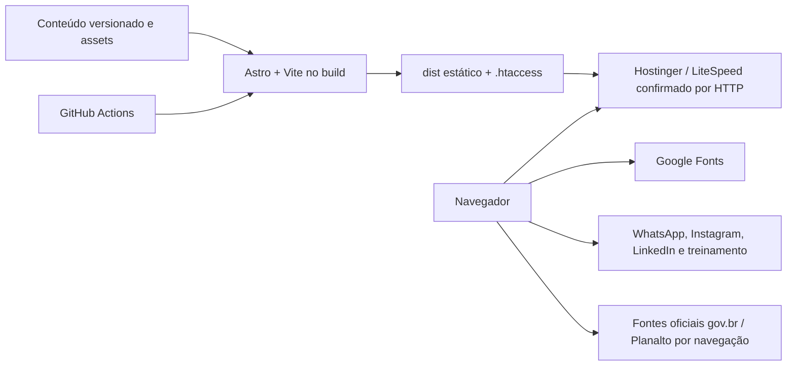

# Inventário e arquitetura de segurança

**Data da análise:** 2026-10-08
**Checkout:** `astro-site` — `security/auditoria-hardening-2026-10-08`, base `5a5edaf`
**Estado inicial:** worktree limpo; remoto `origin` = `https://github.com/wandersongandra/ajn-site.git`.

## Resumo

O repositório constrói um site institucional Astro em modo estático. A saída contém HTML, CSS, JavaScript e imagens; não há adapter, SSR, banco, API própria, autenticação, painel ou runtime Node necessário para servir o site. O WordPress e o banco legado não estão no checkout e não foram executados ou alterados.

## Evidências de arquitetura e fluxo

- `package.json`: `check`, `build`, `preview` e auditorias Node; gerenciador npm (`package-lock.json`, lockfile v3).
- `astro.config.mjs`: saída estática padrão, integração sitemap, canonical pelo `site` e redirecionamento Astro para `/informacoes`.
- `README.md`: declara `output: 'static'`, sem banco/API/SSR/ISR/CMS/painel.
- `src/pages/`: páginas estáticas e endpoint de build `robots.txt.ts` com `prerender = true`; nenhum endpoint de aplicação.
- `.github/workflows/quality.yml`: valida preview com `PUBLIC_ALLOW_INDEXING=false` e build de produção com origin apex/indexação ligada; não contém upload/deploy.
- `public/.htaccess`: redirecionamento de `/informacoes`, regra preparada `www`→apex, CSP atual enforced + candidata Report-Only, HSTS inicial curto. Aplicação no hPanel ainda não comprovada para esta revisão.
- Runtime local observado: Node `v24.13.0`, npm `11.12.1`, Astro `7.3.6`, TypeScript `6.0.3`, Zod `4.6.5`, `@astrojs/sitemap` `3.7.4`.

## Fronteiras de confiança e entradas

| Fronteira | Dados/fluxo | Controle observado |
|---|---|---|
| Arquivos versionados → build | Conteúdo TS, rotas, links, títulos, imagens | validação Zod de conteúdo e build estático |
| URL do visitante → busca do blog | `q`, `tema` via `URLSearchParams` | comparação textual; DOM atualizado por `textContent` |
| URL do visitante → página | rota estática; sem query interpretada no servidor | catálogo de rotas compilado |
| Formulário de contato | `PUBLIC_CONTACT_ENDPOINT` de build | formulário só renderiza para URL HTTPS sem credenciais; vazio na produção observada, com fallback WhatsApp/e-mail |
| Navegador → terceiros | Google Fonts e links externos de contato/referência | HTTPS; scripts remotos não foram encontrados |
| GitHub Actions → build | PR/push e conteúdo do repositório | permissões padrão `contents: read`; sem segredo de deploy observado |

## Ativos

- Integridade do site, conteúdo técnico e rotas/canonicals.
- Dados que o visitante possa enviar voluntariamente por WhatsApp/e-mail; não há coleta pelo formulário na produção observada.
- Contas, segredos e deploy da Hostinger/GitHub: não presentes no checkout e sem acesso administrativo nesta análise.
- Dumps, backups e instalação WordPress legada: fora do repositório; preservados e fora do escopo de escrita.

## Recursos externos

- Google Fonts (`fonts.googleapis.com`, `fonts.gstatic.com`) é carregado em CSS/fonte pelo `BaseLayout.astro`.
- Links de navegação para WhatsApp, Instagram, LinkedIn, plataforma de treinamento e fontes oficiais. Não há scripts externos nem iframes no código atual.
- O servidor de produção respondeu `LiteSpeed`; Hostinger é plausível pelo contexto, mas o mecanismo de deploy não foi comprovado pelo repositório.

## Premissas e limitações

- **CONFIRMADO:** repositório, remoto, branch, versão do runtime, saída estática, workflows e rotas locais.
- **CONFIRMADO por GET passivo em 2026-10-08:** `ajnengenharia.com.br` serve HTML Astro, HTTPS, canonical apex, CSP, `nosniff`, `X-Frame-Options`, `Referrer-Policy` e `Permissions-Policy`; não envia HSTS.
- **NÃO VERIFICADO:** painel/conta Hostinger, processo que publica `dist`, cache/CDN, configuração administrativa do GitHub, conteúdo/configuração de e-mail, SPF/DKIM/DMARC, inventário de subdomínios.
- **BLOQUEADO:** raiz do host de staging não respondeu; seus headers e artefato atual não puderam ser confirmados.
- Nenhum teste ativo, fuzzing, carga, POST de formulário ou alteração externa foi realizado.

## Riscos iniciais

Ver matriz consolidada em `10-RELATORIO-FINAL.md`. Prioridades observadas: HSTS ausente; CSP mais aberta que os recursos necessários; esquema de links do conteúdo não restringido pelo schema; URLs legais de privacidade/termos retornam 404; mecanismo de deploy e status administrativo do GitHub não verificáveis.
